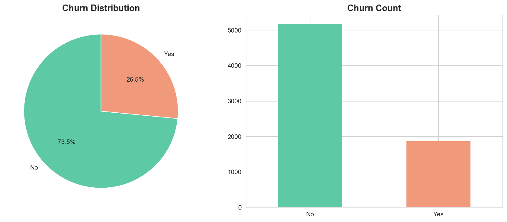
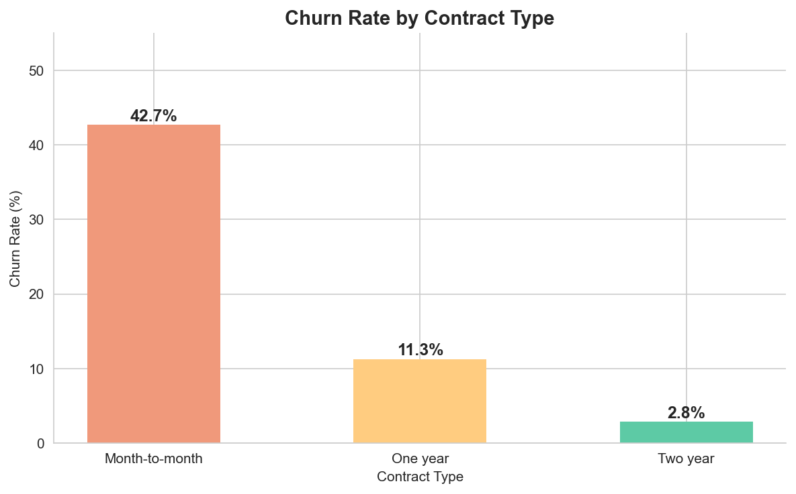
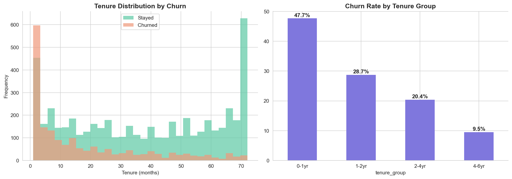
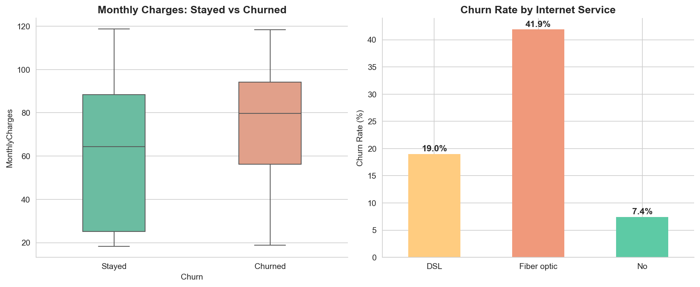
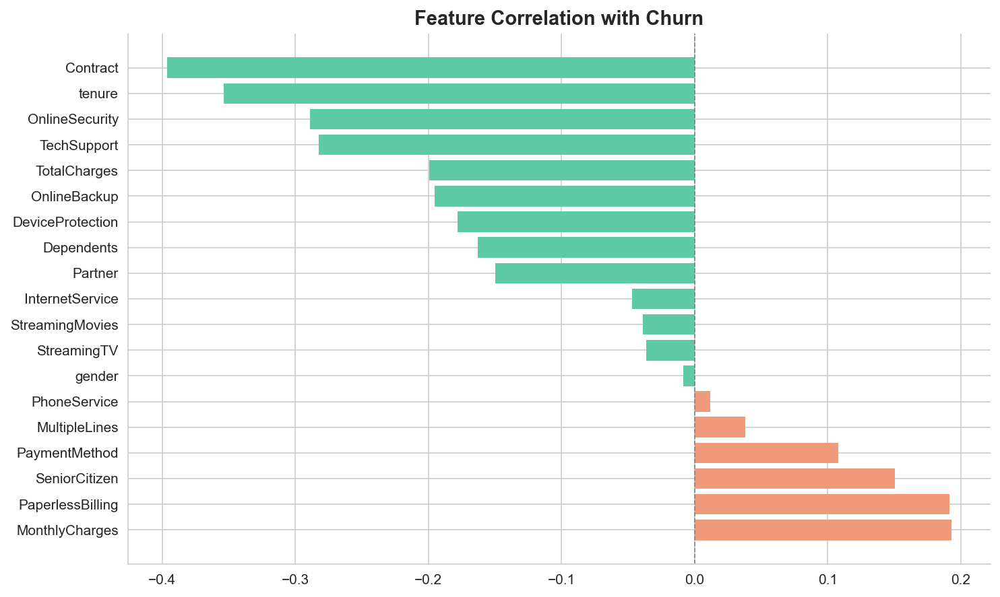

# Telco Customer Churn Analysis
### Understanding Why Customers Leave & How to Retain Them

---

## Business Problem

Telecom companies lose millions annually to customer churn. The challenge is not just understanding that customers leave — it is predicting **who** will leave and **why**, so the business can act before it is too late.

This project analyzes **7,032 telecom customers** to uncover the key drivers of churn and deliver actionable retention strategies.

---

## Dataset

| Detail | Value |
|--------|-------|
| Source | [Telco Customer Churn — Kaggle](https://www.kaggle.com/datasets/blastchar/telco-customer-churn) |
| Customers | 7,032 |
| Features | 21 |
| Target | Churn (Yes / No) |
| Overall Churn Rate | 26.5% |

---

## Project Workflow

```
1. Data Loading & Exploration
         ↓
2. Data Cleaning & Preprocessing
         ↓
3. Exploratory Data Analysis (EDA)
         ↓
4. Correlation & Feature Analysis
         ↓
5. Logistic Regression Model
         ↓
6. Key Insights & Business Recommendations
```

---

## Key Visualizations

**Churn Distribution**



1 in every 4 customers churns — a significant business risk that demands proactive retention strategies.

---

**Churn Rate by Contract Type**



Month-to-month customers churn at 42%, compared to just 3% for two-year contracts. Contract type is one of the strongest predictors of churn.

---

**Churn Rate by Tenure**



Customers in their first 12 months have a churn rate of approximately 47%. Early-stage customers are the highest-risk segment.

---

**Monthly Charges vs Churn**



Customers paying higher monthly charges are significantly more likely to churn — price sensitivity is a major driver.

---

**Feature Correlation with Churn**



---

## Key Findings

| Rank | Factor | Correlation | Insight |
|------|--------|------------|---------|
| 1 | Monthly Charges | +0.19 | Higher charges increase churn risk |
| 2 | Paperless Billing | +0.19 | Tech-savvy users compare prices easily |
| 3 | Senior Citizen | +0.15 | Older customers need more support |
| 4 | Month-to-month Contract | — | 42% churn vs 3% for 2-year contracts |
| 5 | New Customers (0-12 mo) | — | 47% churn rate in first year |
| 6 | Partner | -0.15 | Shared plans significantly reduce churn |

---

## Business Recommendations

**1. Loyalty Discounts for High-Charge Customers**
Offer targeted discounts to customers paying above $70/month after the first 6 months. This directly addresses the strongest churn driver.

**2. Onboarding Program for New Customers**
The first 12 months carry a 47% churn rate. A structured onboarding program with check-ins and usage guidance can significantly reduce early attrition.

**3. Promote Partner and Family Plans**
Having a partner is the strongest retention factor identified. Proactively marketing shared plans to single subscribers can improve loyalty.

**4. Proactive Campaigns for Paperless Billing Users**
This segment is tech-savvy and comparison-driven. Regular personalized offers and value reminders can reduce their likelihood of switching.

---

## Model Performance

| Metric | Score |
|--------|-------|
| Algorithm | Logistic Regression |
| Accuracy | ~80% |
| Train / Test Split | 80% / 20% |
| Stratified | Yes |

---

## Project Structure

```
TelcoCustomerChurn/
│
├── TelcoCustomerChurn.ipynb          <- Main analysis notebook
├── WA_Fn-UseC_-Telco-Customer-Churn.csv
├── churn_distribution.png
├── churn_by_contract.png
├── churn_by_tenure.png
├── churn_by_charges.png
├── churn_correlation.png
└── README.md
```

---

## How to Run

```bash
# 1. Clone the repo
git clone https://github.com/RaniaMofeed/TelcoCustomerChurn.git

# 2. Install requirements
pip install pandas numpy matplotlib seaborn scikit-learn

# 3. Open the notebook
jupyter notebook TelcoCustomerChurn.ipynb
```

---

*Analysis by **Rania Mofeed** | [LinkedIn](https://www.linkedin.com/in/raniamofeed) | [GitHub](https://github.com/RaniaMofeed)*
